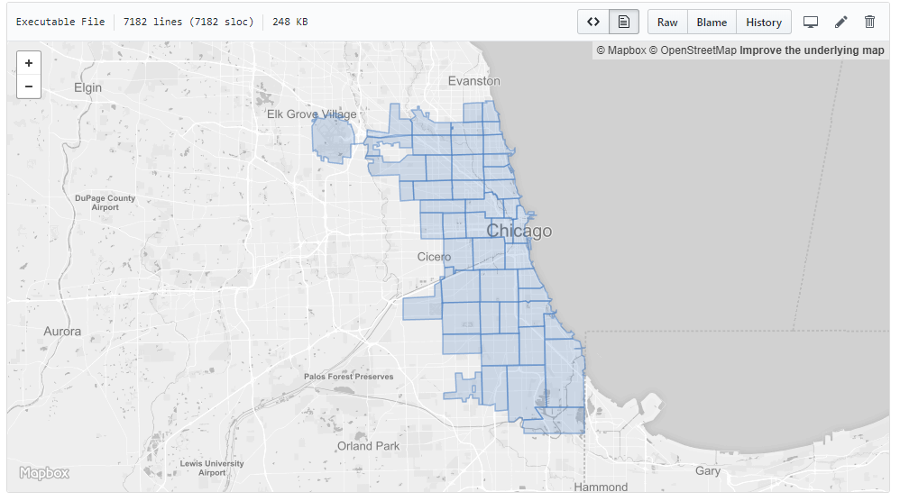

👶👧👩

What is <strong>TurfJS?</strong>

Advanced <strong>geospatial analysis</strong> for browsers and Node.js

<strong>Modular => </strong> 
Area, Bounding Box, Buffer, Grids, Intersect, Isolines, Length, Random, Sample, Voroni, Within...

JavaScript functions that speak <strong>GeoJSON</strong>

<strong>What</strong> is GeoJSON?

<pre><code>
/** GeoJSON is a single JSON file containing one or more features */
{
  "type": "FeatureCollection",
  "features": [
    {
      "type": "Feature",
      "geometry": {
        "type": "Point",
        "coordinates": [-82, 39] /*WGS 84*/
      },
      "properties": {
        "field": "value"
      }
    }
  ]
}
</code></pre>

GeoJSON is <strong>Everywhere</strong>

Geocoder APIs | ArcGIS Feature to JSON | USGS Earthquake Feed | DATA.GOV (1,600+ Datasets) | AGOL Query Response & Exports | geojson.xyz (Natural Earth Data+) | Native Support in QGIS (Editing)

<h1>GitHub Support (2013)</h1>

Free & Open 

Source Software
[github.com/Turfjs](https://github.com/Turfjs)

# Include in your HTML
 
<pre><code>https://cdnjs.cloudflare.com/ajax/libs/Turf.js/5.1.5/turf.min.js</code></pre>
  
# Install via NodeJS  
 
<pre><code>npm install @turf/turf --OR-- npm install @turf/bbox</code></pre>

Why use <strong>TurfJS?</strong>

<strong>Simple geospatial queries</strong>

Complex geospatial analysis <strong>(in NodeJS)</strong>

Creating spatial metadata (bounding box)

A Few Examples

  Turf Within
  <pre><code>turf.booleanWithin(point, polygon)</code></pre>

<h1>Find My County</h1>
<pre><code>
var result = "";
counties.features.map(function(county) {
  var point = turf.point([x,y]);
    if (turf.booleanWithin(point, county) {
      result = county.properties.NAME;
    }
});
</code></pre>

  <input type="text" class="form-input" value="-82,39">
  <button class="btn btn-primary input-group-btn" id="withinSubmit">Submit</button>

Click the Submit button on the previous page

🤩😵🧐

😢😭😿

  Practical Applications

  Local <strong>Authoritative</strong> Open Data

  Turf Nearest
  <pre><code>Array.filter()</code></pre>
  <pre><code>turf.nearestPoint(point, points)</code></pre>

# Find the Closest Playground
<pre><code>
var data = amenities.features.filter(function(a) {
  return a.properties.TYPE === 'Playground' 
})
var playgrounds = turf.featureCollection(data);
var result = turf.nearestPoint(point, playgrounds)
</code></pre>

  <input type="text" value="-82.007054,39.942022">
  <button class="btn btn-primary input-group-btn" id="nearestSubmit">Submit</button>

Loading...

😍😍😍

Advanced Analysis in <strong>TurfJS</strong>

Visualizing <strong>Crashes</strong> in Muskingum County (>7k)

Hexgrids
<pre><code>turf.hexGrid(bbox, size, opts)</code></pre>
Intersect
<pre><code>turf.intersect(a,b)</code></pre>
Collect
<pre><code>turf.collect(p, pts, field, name)</code></pre>

🐨😴💤

<h1>Turf Hexgrids</h1>
<pre><code>
var bbox = [-82.5, 39.7, -81.5, 40.18];
var size = 1;
var options = {
  units: 'miles'
};

var hexgrid = turf.hexGrid(bbox, size, options)
</code></pre>

Turf Intersect 
<pre><code>
/* loop through each grid
 * add the intersecting areas to the clippedGrid
 * calculate the area in sq miles */

var clippedGrid = { "type":"FeatureCollection", "features":[] }

hexgrid.features.map(function(grid) {
  var toFt = 0.00000386102159
  var intersect = turf.intersect(grid, muskingum);
  if (intersect) {
    clippedGrid.features.push(intersect);
  }
});
</code></pre>

  

    

  

Turf in <strong>Node JS</strong>

Find the Nearest National Park 🏕️ 45MB GeoJSON National Park Boundary File

<pre><code>turf.explode(polygon)</code></pre>

<pre><code>turf.nearestPoint(point, points)</code></pre>

<pre><code>
function findNearestPolygon(point, polygon) {
  var vertices = turf.explode(polygon)
  return turf.nearestPoint(point, vertices)
}
</code></pre>

Find the Nearest Polygon
  <form class="input-group">
    

      <input class="form-input" name="lng" type="text" id="lng" placeholder="Longitude" value="-82">
    

    

      <input class="form-input" type="text" id="lat" placeholder="Latitude" name="lat" value="39">
    

    <button class="btn btn-primary form-input" id="nearestPolySubmit" style="float:left;">Submit</button>
  </form>

Loading...

<!--div>
Turf Center
<pre><code>
var center = {
  "type": "FeatureCollection",
  "features": []
};

/* Calculate the center for each grid */

hexgrid.features.map(function (feature) {
  center.features.push(turf.centerOfMass(feature));
});
</code></pre>
</div-->

Support [TurfJS](https://opencollective.com/turf)

Thanks!
Malcolm Meyer
[@getbounds](https://twitter.com/getbounds)

